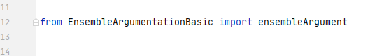
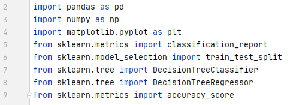
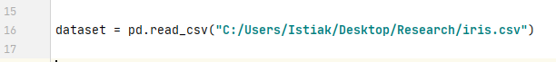
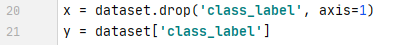
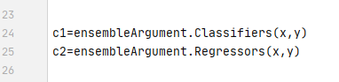
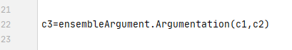
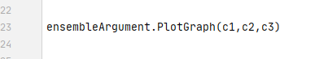
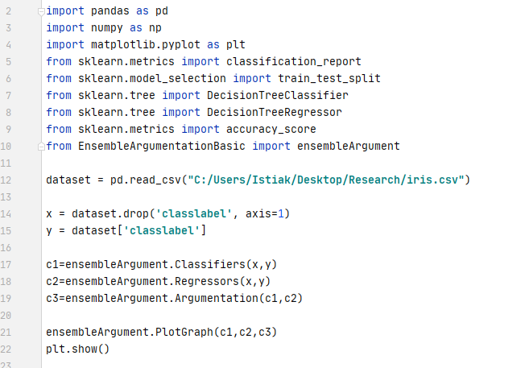

<h1>BasicEnsembleArgumentation</h1>

The BasicEnsembleArgumentation library provides methods to generate reliable results. A data set is classified by several models (classifiers). Different models produce different outputs and the produced outputs are combined by an argumentation approach. The argumentation approach produces a final output through a decision making process. The whole process follows an ensemble architecture.

  

<h2>Attacking Relation:</h2>

The outputs of two models (Classifier, Regressor) attack each other. An argument (a value of output set) with high probability attacks an argument that holds low probability. If the values from both output sets (Classifier, Regressor) are similar based on similar index position then they will not attack. 

<h2>Outputs:</h2>

The library generates the following output sets. 

<ul>
  <li>Output set of Classifier model.</li>
  <li>Output set of Regressor model.</li>
  <li>Accepted output set of an argumentation model.</li>
  <li>Output set of similar values based on similar index position.</li>
  <li>Output set of similar index position based on similar values.</li>
  <li>The graphical views of different output sets.</li>
</ul>

<h1>User Manual</h1>

Install Basicenssembleargumentation: 

<code>pip install Basicensemblelearningargumentation</code>

Import the library package: 

Import additional pacakages: 

Upload a data set using pandas. The data set should contain numerical data. 

Define the independent and dependant variables.

Call the two functions namely Classifiers and Regressors and instantiate the two functions into two different variables such as c1 and c2.  

Call the Argumentation function with the required parameters (e.g.c1, c2). Instantiate the function in a variable (e.g. c3). 

Call the PlotGraph function with the required parameters (e.g.c1, c2, c3). 

Call the show() function to represent the graphical views. 

The following example help the user to use the library. 

<h1>Author </h1>
<ul><li>Istiak Ahmed</li></ul>

<h1>License </h1>
<ul><li><a href="https://opensource.org/licenses/MIT">MIT</a></li></ul>

