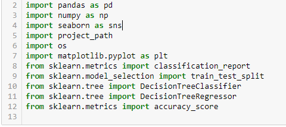
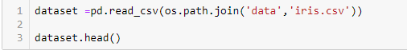
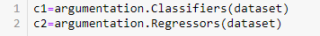

<h1>BasicEnsembleArgumentation</h1>

The BasicEnsembleArgumentation library provides methods to generate reliable results. A data set is classified by several models (classifiers). Different models produce different outputs and the produced outputs are combined by an argumentation approach. The argumentation approach produces a final output through a decision making process. The whole process follows an ensemble architecture. 
  
<h1>User Manual</h1>

Install Basicenssembleargumentation: 

<code>pip install Basicenssembleargumentation</code>

Import the library: 

Import additional pacakages: 

Upload a data set using panda. The last column's name of the uploaded data set should be classlabel and the classlabel column should contain numerical data. 

Assign the outcomes of two models into two different variables. Classifiers and Regressors functions classify the data set and predict outcomes based on classified data.

Insert two variables as input parameters in the Argumentation function. Argumentation function produces an outcome combining the outcomes of two models through a decision making process. The different outcomes from different models attack each other and finally the winner outcome is regarded as an outcome.  

Insert two variables as input parameters in the PlotGraph function. PlotGraph function generates different graphs for different outcomes. 

<h1>Author </h1>
<ul><li>Istiak Ahmed</li></ul>

<h1>License </h1>
<ul><li><a href="https://opensource.org/licenses/MIT">MIT</a></li></ul>

